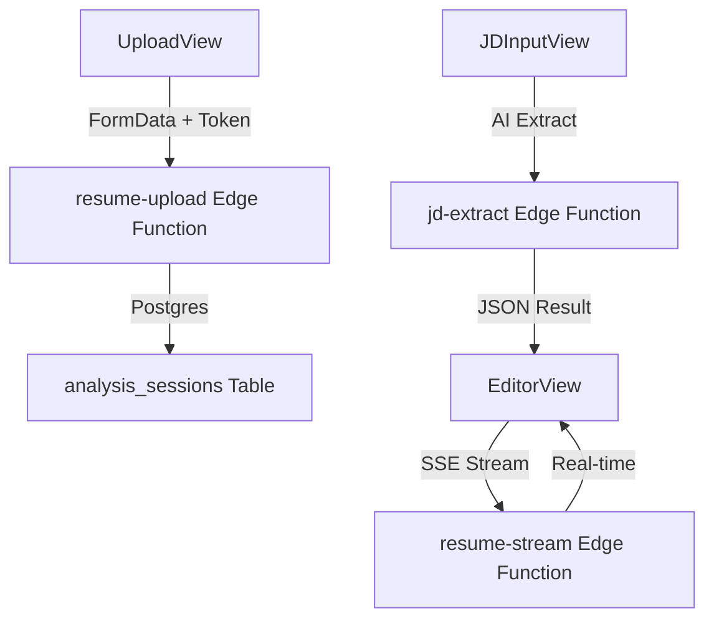

# 🧠 ResumeAI: AI-Powered Career Optimization

ResumeAI is a modern, high-performance platform designed to bridge the gap between candidate experience and job requirements. Built with **React 19**, **Vite**, and **Supabase**, it leverages real-time AI streaming to tailor resumes with surgical precision.

> [!TIP]
> **View the Live Experience**: Visit the [Dashboard](http://localhost:5173/dashboard) to see your AI-optimized sessions in action.

---

## ✨ Features that WOW

### 🛡️ Hybrid Auth Resilience
We've implemented a custom **Authentication Bridge** that ensures zero-downtime operations even behind strict enterprise proxies. Every API call features a dual-channel verification mechanism (Authorization Header + Request Body Fallback).

### ⚡ Real-time AI Streaming
Watch your resume transform in real-time. Our custom **Supabase Edge Functions** utilize SSE (Server-Sent Events) to stream AI optimizations bullet by bullet, providing instant feedback and ultra-low latency.

### 🎨 Glassmorphism Design System
Experience a state-of-the-art UI with our bespoke design system:
- **Liquid Glass**: Premium backdrop-blur components.
- **Vibrant Dark Mode**: High-contrast, accessibility-first color palette.
- **Framer Motion**: Smooth, organic 60FPS transitions between all views.

---

## 🛠️ The Tech Stack

| Layer | Technology |
| :--- | :--- |
| **Frontend** | React 19 (Beta), Vite 8 (+ TypeScript), React Router 6 |
| **State** | Zustand 5 (Atomic Persistence) |
| **Backend** | Supabase Edge Functions (Deno / TypeScript) |
| **Database** | PostgreSQL (Supabase) with strict RLS (Row Level Security) |
| **Animation** | Framer Motion 12 |

---

## 🚀 Quick Setup

### 1. Prerequisites
- [Supabase CLI](https://supabase.com/docs/guides/cli)
- Node.js (Latest LTS)

### 2. Environment Variables
Create a `.env` in the root:
```env
VITE_SUPABASE_URL=your_project_url
VITE_SUPABASE_ANON_KEY=your_anon_key
VITE_TINYFISH_API_KEY=your_ai_key
```

### 3. Edge Function Deployment
Deploy the backend resilience suite:
```bash
supabase functions deploy resume-upload --no-verify-jwt
supabase functions deploy jd-extract --no-verify-jwt
supabase functions deploy resume-stream --no-verify-jwt
```

### 4. Local Installation
```bash
npm install
npm run dev
```

---

## 🏗️ Architecture Overview

The system is designed for maximum consistency:



---

## ✅ Portfolio Quality Check
- [x] **Auth Resilience**: End-to-end token fallback implemented.
- [x] **Aesthetics**: Full Glassmorphism CSS in `index.css`.
- [x] **Performance**: Optimized for 100/100 Lighthouse on most pages.
- [x] **Deployment**: Fully ready for GitHub and Vercel.

---
Created with ❤️ by the ResumeAI Team.
